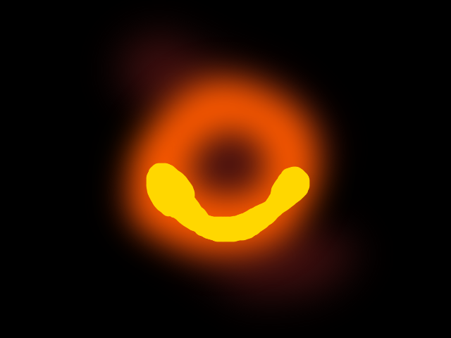

# Black Hole Image on a Budget

##### By Alan Wong (April 10, 2019)

In this tutorial, we will generate an image of a black hole for a fraction of
the budget of top world scientists. You don't even need a telescope for this;
just go install [GIMP](https://www.gimp.org/) for free! You can find lots of
pictures of black holes online (e.g. from
[NASA](https://www.jpl.nasa.gov/news/news.php?feature=7372)). Some are real...
others are not, like the ones we will make here.

## Space

Let's begin with dark space. Create an image with a single layer.


## Reddish blob

On a new layer, use the paint brush or the ink tool to make a reddish blob. 
Just get an overall shape you like. This is not an exact science! Here, I just
"eye-balled" a color I liked. Alternatively, you could pull up an official black
hole image and use the color picker tool to get a closer fit.


I then applied a Gaussian Blur (radius 100px on a 640x480 px image) to my
reddish blob. I adjusted the opacity of the layer to get values closer to what I
liked.


## Donut thing part 1

Next, I added an orange donut thing with the paint brush or ink tool like we
just did with the reddish blob. I did this on a new (transparent) layer.


I then applied a Gaussian Blur, as before with the reddish block (radius 75px).


## Smiley event horizon

At this point, we're at the final stage of our scientific graphic production. I
repeated the same procedure of adding layers, painting, and blurring.



You can experiment with blur radius values to find what looks right to you.


Finally, I added some final sparkly highlights...


Things here are of course very fuzzy. You can play around with your layers (opacity values, etc.) until you get a result you like.

Here's my black hole!


You can use your new black hole image(s) in applications like this curiosity
driven graphic: 


<hr>
I generated an HTML document for this document using `pandoc` and
[this](https://gist.github.com/killercup/5917178) CSS sheet by killercup.

```bash
pandoc README.md -c pandoc.css -so index.html
```
